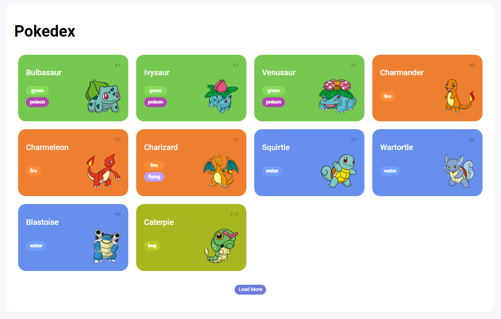
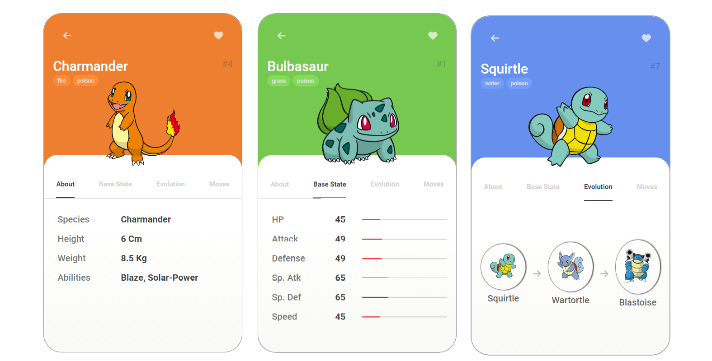

# Trilha JS Developer - Pokedex



Este é um projeto de Pokedex, que exibe informações sobre vários Pokémon. O objetivo deste projeto é permitir que os usuários pesquisem e visualizem informações úteis sobre as diferentes espécies de Pokémon disponíveis.

## Funcionalidades

- Fornece informações atualizadas sobre a lista de Pokémons conforme são selecionados novos Pokémon.
- Exibe informações detalhadas sobre o Pokémon selecionado, incluindo tipo, habilidades, fraquezas, evoluções, entre outras informações relevantes.



## Tecnologias

Este projeto foi construído com as seguintes tecnologias:

- [HTML](https://developer.mozilla.org/pt-BR/docs/Learn/Getting_started_with_the_web/HTML_basics)
- [CSS](https://www.w3schools.com/css/default.asp)
- [JavaScript](https://developer.mozilla.org/en-US/docs/Web/javascript)
- [PokéAPI](https://pokeapi.co/)

## Como Usar

Clone o projeto

```bash
  git clone https://github.com/valdir-alves3000/js-developer-pokedex.git
```

Abra o arquivo index.html em seu navegador.
